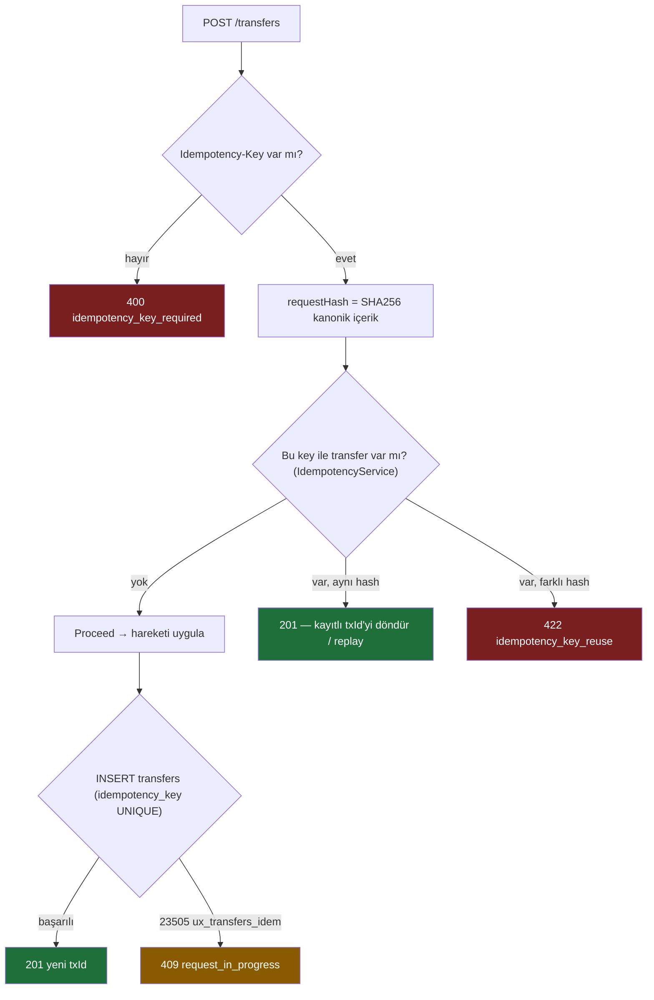
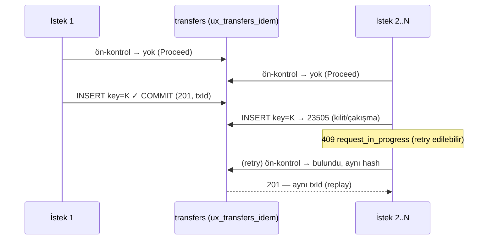

# Idempotency — Aynı İsteği İki Kez Almak

> Öğretici rehber. Para transferi gibi sistemlerde **client tarafı tekrarının** (retry, çift-tık,
> Postman replay) ikinci kez para hareketine yol açmasını nasıl engelleriz. Bu doküman **Adım A**'yı
> anlatır: idempotency'nin **DB-garantili çekirdeği** + **request hashing** collision guard. Redis
> ön-kontrol katmanı (**Adım B**) ayrı bir feature'dır. İlgili: [race-condition.md](race-condition.md).

---

## Özet

Race-condition feature'ı **sunucu-içi** eş zamanlılığı çözer (aynı anda gelen iki çekimin birbirini
ezmesi). Ama bambaşka bir tekrar türü daha var: **aynı client'ın aynı isteği iki kez göndermesi.**

- Ağ timeout'u → client emin olamaz, **retry** atar.
- Kullanıcı "Gönder" butonuna **iki kez** basar.
- Postman'de "Send"e arka arkaya tıklanır (istismar / kaza).

Bunların hepsi sunucuya **iki ayrı, geçerli istek** gibi görünür → iki ayrı transfer → **iki kez para
hareketi.** Bu, eş zamanlılık hatası değildir (her istek kendi içinde doğrudur); **niyet** tektir ama
**çağrı** iki kez gelmiştir.

**Çözüm — Idempotency-Key.** Client her mantıksal işlem için bir kez üretip retry'larda **sabit
tuttuğu** bir anahtar gönderir. Sunucu aynı anahtarı ikinci kez gördüğünde işlemi **tekrar etmez**,
ilk sonucu döndürür (idempotent replay).

> **Neden sadece içerik karşılaştırması yetmez?** Para sisteminde **bilerek yapılan iki özdeş transfer
> meşrudur** (Alice, Bob'a peş peşe iki kez 10 TL gönderebilir). Yani "aynı içerik = duplicate" demek
> *yanlıştır* — meşru tekrarları bloklar. Bu yüzden dedup'ın anahtarı **içerik değil, client'ın açık
> `Idempotency-Key`'idir.** İçerik hash'i ise yalnızca bir **muhafız**dır (aşağıda).

---

## Request Hashing — collision guard

Her yazma isteği için kanonik bir SHA256 hesaplanır ve transfer'le birlikte saklanır
([`RequestHasher`](../src/MoneyTransfer.Api/Infrastructure/Idempotency/RequestHasher.cs)):

```
requestHash = SHA256( "POST" | path | ...alanlar... | amount | reason )
```

Bu hash'in tek işi, anahtarın **yanlış kullanımını** yakalamaktır:

- Aynı `Idempotency-Key` + **aynı** içerik → hash eşleşir → bu gerçek bir **retry** → ilk sonucu döndür.
- Aynı `Idempotency-Key` + **farklı** içerik → hash farklı → anahtar **yeniden kullanılmış** (client
  hatası veya sahte istek) → **422 `idempotency_key_reuse`** ile reddet.

> **Sunucu timestamp'i hash'e GİRMEZ.** Hash'e her çağrıda değişen bir değer (ör. `now()`) koyarsak,
> aynı retry bile farklı hash üretir → dedup hiçbir zaman tetiklenmez. Zaman mantıksal isteğin
> parçasıysa client'tan gelmeli ve retry'larda sabit kalmalıdır.

---

## Akış (Adım A — yalnızca PostgreSQL)

Her yazma handler'ı şu sırayı izler ([CreateTransfer.cs](../src/MoneyTransfer.Api/Features/Transfers/CreateTransfer.cs)):



İki savunma katmanı vardır:

1. **Okuma tarafı ön-kontrol** ([`IdempotencyService`](../src/MoneyTransfer.Api/Infrastructure/Idempotency/IdempotencyService.cs)):
   anahtara göre mevcut transfer'i arar → `Proceed` / `Replay` / `Reuse`.
2. **Yazma tarafı backstop** — `transfers.idempotency_key` üzerindeki **partial unique index**
   (`ux_transfers_idem`). İki istek aynı **yeni** anahtarla ön-kontrolü eş zamanlı geçerse, INSERT'te
   biri kazanır, diğeri `23505` alır → **409 `request_in_progress`** (retry edilebilir; sonraki deneme
   `Replay`'e düşer). Bu, anahtarın benzersizliğini **veritabanının** garanti etmesini sağlar — uygulama
   mantığına güvenmez.

### Eş zamanlı "retry fırtınası" — ne olur?

Aynı anahtarla aynı anda gelen N istek:



Sonuç garantisi: **anahtar başına en fazla bir transfer.** Para asla iki kez hareket etmez; geç kalan
kopyalar ya 409 (retry edilebilir) alır ya da kazananın sonucunu replay eder.

---

## Davranış tablosu

| Senaryo | Sonuç |
|---|---|
| Key yok | **400** `idempotency_key_required` |
| Yeni key, ilk istek | **201** — transfer oluşturulur |
| Aynı key + aynı içerik (retry) | **201** — aynı `txId` (replay, yeni hareket YOK) |
| Aynı key + farklı içerik | **422** `idempotency_key_reuse` |
| Aynı yeni key, eş zamanlı kopya | **409** `request_in_progress` (retry → replay) |
| Farklı key (meşru özdeş transfer) | **201** — ayrı transfer (bloklanmaz) |

---

## Sınırlar ve Sıradaki Adım (Redis — Adım B)

Adım A tamamen doğrudur ama iki sınırı vardır; ikisini de **Redis katmanı** (Adım B) çözecek:

- **DB'ye varır:** Tekrarlanan istek yine de uygulama + bir DB sorgusu kadar ilerler. Redis ön-kontrolü,
  yinelenenleri **DB'ye varmadan** reddeder (daha ucuz, istismara dayanıklı).
- **`in_progress` durumu yok:** Adım A'da eş zamanlı kopya 409 alıp retry eder. Redis durum makinesi
  (`in_progress` → `completed` + yanıt önbelleği) ile ilk istek tamamlanana kadar kopyalar net bir
  409 `request_in_progress` görür, tamamlanınca **kaydedilmiş yanıtı** alır.

Önemli tasarım kararı: **Redis bir hızlandırma katmanıdır, doğruluğun kaynağı değil.** Redis düşer ya da
bir anahtarı evict ederse, buradaki **DB backstop** devreye girer (graceful degradation) — idempotency
Redis TTL'inin ötesinde **kalıcı** kalır. Production-grade sıralama bu yüzden **önce DB (doğruluk),
sonra Redis (performans)**'tır.

---

## Doğrulama

- `k6/02-idempotency.js` — aynı anahtarla N eş zamanlı özdeş istek → para tam bir kez hareket eder,
  self-audit tutar, replay para taşımaz, farklı-payload-aynı-key → 422.
- Postman "Idempotency" klasörü — replay (#1/#2 aynı txId), reuse (422), eksik key (400).
- Mevcut k6 (01-race, 03-ring) ve newman regresyonu: her yazma artık istek başına benzersiz anahtar
  taşır → meşru özdeş hareketler bloklanmaz.
