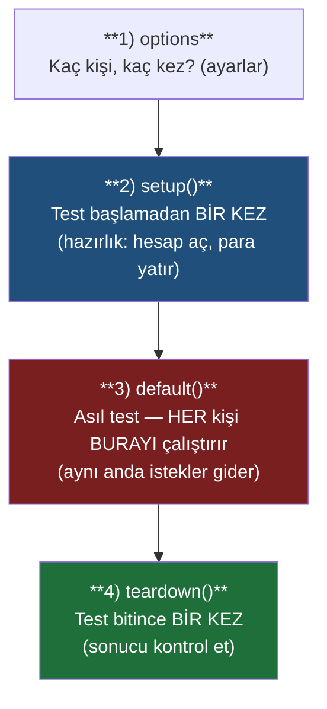

# K6 ile İlk Testin — Sıfırdan, Satır Satır

> Bu rehber, **K6'yı hiç bilmeyen** birinin okuyup **kendi testini yazabilmesi** için yazıldı.
> Tek bir gerçek test dosyasını ([k6/01-race-withdrawals.js](../k6/01-race-withdrawals.js))
> baştan sona, **satır satır** açıklıyoruz. Konuyla ilgili arka plan için:
> [race-condition.md](race-condition.md).

---

## K6 nedir? (en sade haliyle)

**K6**, bir sunucuya **aynı anda çok sayıda istek** gönderip sonuçları kontrol eden bir test
aracıdır. Testleri **JavaScript** ile yazarsın.

Biz onu hız ölçmek için değil, şunu **kanıtlamak** için kullanıyoruz:

> Aynı hesaptan **tam aynı anda** 40 kişi para çekmeye çalışırsa, sistem yanlış davranıp
> hesabı eksiye düşürür mü, yoksa fazlalıkları reddeder mi?

Normal bir test (tek tek istek atan) bunu yakalayamaz, çünkü bu tür hatalar **ancak aynı anda**
çok istek gelince ortaya çıkar. K6 tam da bunu yapar: çok sayıda isteği **paralel** atar, sonra
"para doğru mu kaldı?" diye bakar.

---

## Sıfırdan bir test için hangi dosyalar gerekli?

**Mutlak minimum sadece iki şeydir:**

1. **K6 programı** — bilgisayarında kurulu olabilir ya da Docker imajıyla çalıştırırsın (kurulum
   gerekmez).
2. **Bir test dosyası** — `.js` uzantılı, içinde test mantığını yazdığın dosya.

Yani teorik olarak **tek bir `.js` dosyası** yeterli. Bu proje, düzen için iki dosya daha ekler:

| Dosya | Zorunlu mu? | Ne işe yarar |
|---|---|---|
| **Test dosyası** (`k6/01-race-withdrawals.js`) | ✅ Evet | Testin kendisi: ne yapılacak, ne kontrol edilecek |
| **Yardımcı dosya** (`k6/lib/ledger.js`) | ❌ Hayır (ama düzenli) | Tekrar eden işleri (hesap aç, para yatır...) tek yerde toplar |
| **Docker ayarı** (`docker-compose.yml` içindeki `k6` servisi) | ❌ Hayır | K6'yı kurmadan, tek komutla çalıştırmak için |

Aşağıda önce **test dosyasını**, sonra **yardımcı dosyayı** satır satır açıklayacağız.

---

## Bir K6 testinin 4 aşaması (önce bunu anla)

Her K6 testi şu sırayla çalışır. Bunu bilmeden gerisi anlaşılmaz:



- **options** — Testin ayarları. "Kaç sanal kullanıcı, her biri kaç kez istek atsın?"
- **setup()** — Test başlamadan **bir kez** çalışır. Hazırlık burada yapılır (hesabı aç, parayı
  yatır). Buradan döndürdüğün veri, diğer aşamalara `data` diye geçer.
- **default()** — **Asıl test.** Her sanal kullanıcı bu fonksiyonu çalıştırır. İşte "aynı anda çok
  istek" burada olur.
- **teardown()** — Test bitince **bir kez** çalışır. "Sonuç doğru mu?" kontrolünü buraya koyarız.

> **Sanal kullanıcı (VU)** = K6'nın senin yerine paralel istek atan "sahte kullanıcı"sı. 40 sanal
> kullanıcı = aynı anda 40 istek hattı.

---

## 1. Test dosyası — `01-race-withdrawals.js` (satır satır)

Bu test şunu yapar: **bir hesaba** sadece 25 çekime yetecek para koyar, sonra **40 çekimi aynı anda**
atar. Doğru bir sistemde tam **25 tanesi** başarılı olmalı, gerisi reddedilmeli, hesap eksiye
düşmemeli.

### Bölüm 1 — Gerekli araçları içeri al (import)

```javascript
import http from 'k6/http';
import { check } from 'k6';
import { BASE, headers, createAccount, deposit, balanceOf, sumEntries } from './lib/ledger.js';
```

- **Satır 1:** `http` — istek atma aracı (`http.post`, `http.get`). K6'nın içinden gelir.
- **Satır 2:** `check` — "şu doğru mu?" kontrolü yapan araç. Yine K6'dan gelir.
- **Satır 3:** Kendi yardımcı dosyamızdan (`lib/ledger.js`) hazır fonksiyonları alıyoruz: hesap aç,
  para yatır, bakiye oku, defteri topla. (Bunları birazdan açıklayacağız.)

### Bölüm 2 — Ayarlanabilir değerler (sabitler)

```javascript
const STRATEGY = __ENV.STRATEGY || 'conditional';
const N = parseInt(__ENV.N || '40', 10);
const M = parseInt(__ENV.M || '25', 10);
const UNIT = 100;
const FUNDED = UNIT * M;
```

- **`__ENV.STRATEGY`** — dışarıdan verilen ortam değişkenini okur. **`__ENV`**, "environment"
  (ortam) demektir; testi komut satırından parametreyle değiştirmeni sağlar.
- **`N = 40`** — kaç çekimi **aynı anda** atacağız.
- **`M = 25`** — bakiyenin karşılayabileceği çekim sayısı.
- **`UNIT = 100`** — her çekimin tutarı (kuruş cinsinden).
- **`FUNDED = UNIT * M`** — başlangıç bakiyesi = `100 × 25 = 2500`. Yani **tam 25 çekime** yeter.
  40 çekim atıyoruz; ilk 25'i başarılı olmalı, kalan 15'i (yani 26.'dan 40.'ya kadar) **parasız
  kalıp reddedilmeli**.

### Bölüm 3 — Ayarlar (options): kaç kişi, kaç kez?

```javascript
export const options = {
  scenarios: {
    storm: { executor: 'per-vu-iterations', vus: N, iterations: 1, maxDuration: '60s' },
  },
  thresholds: STRATEGY === 'naive' ? {} : { checks: ['rate==1.0'] },
};
```

- **`scenarios`** — testin nasıl koşacağını anlatan bölüm. İçine istediğin adı verebilirsin; biz
  `storm` (fırtına) dedik.
- **`executor: 'per-vu-iterations'`** — "her sanal kullanıcı belirli sayıda tur atsın" modu.
- **`vus: N`** — **kaç sanal kullanıcı** (burada 40). **`vus`** = "virtual users".
- **`iterations: 1`** — her kullanıcı **1 kez** istek atsın. 40 kullanıcı × 1 = **aynı anda 40
  istek**. Yarışı yaratan şey budur.
- **`maxDuration: '60s'`** — test en fazla 60 saniye sürsün (takılırsa durdur).
- **`thresholds`** — testin **geçti/kaldı** kriteri. `checks: ['rate==1.0']` = "tüm kontroller
  %100 geçmeli, yoksa test BAŞARISIZ". `STRATEGY === 'naive' ? {} : {...}` kısmı şu demek: *eğer
  strateji 'naive' ise kriter koyma (boş `{}`), değilse kriteri uygula*. (Naive bilerek hatalı
  yöntem; onu kırmızıya boyamak istemiyoruz, sadece hatayı göstermek istiyoruz.)

> **`? :` nedir?** "Üçlü operatör" (ternary). `koşul ? doğruysa : yanlışsa` şeklinde kısa bir
> if-else. `a === 'naive' ? {} : {...}` → "naive ise `{}`, değilse `{...}`".

### Bölüm 4 — setup(): hazırlık (bir kez)

```javascript
export function setup() {
  const acc = createAccount('USD', false, STRATEGY);
  deposit(acc, FUNDED, STRATEGY);
  console.log(`[${STRATEGY}] account ${acc} funded ${FUNDED}; firing ${N} withdrawals of ${UNIT}`);
  return { acc };
}
```

- **`createAccount('USD', false, STRATEGY)`** — yeni bir hesap açar. `'USD'` para birimi,
  `false` = eksiye düşmesine izin verme. Geri dönen hesap kimliğini `acc`'a koyar.
- **`deposit(acc, FUNDED, STRATEGY)`** — bu hesaba `FUNDED` (2500) para yatırır.
- **`console.log(...)`** — ekrana bilgi yazar (sadece takip için, teste etkisi yok). Tırnaklar
  ters tırnak (`` ` ``); içine `${değişken}` yazınca değer gömülür.
- **`return { acc }`** — hesabı **döndürür**. Bu sayede `default` ve `teardown` aşamaları bu hesaba
  `data.acc` ile ulaşır. **Bu satır kritik:** setup'ta üretileni sonraki aşamalara taşımanın tek
  yolu budur.

### Bölüm 5 — default(): asıl test (her kullanıcı çalıştırır)

```javascript
export default function (data) {
  http.post(
    `${BASE}/withdrawals`,
    JSON.stringify({ account: data.acc, amount: UNIT, reason: 'race' }),
    { headers: headers(STRATEGY) },
  );
}
```

- **`function (data)`** — `data`, setup'ın döndürdüğü `{ acc }` nesnesidir. Yani `data.acc` =
  hesabımız.
- **`http.post(adres, gövde, ayarlar)`** — bir POST isteği atar. Üç parçası var:
  - **`` `${BASE}/withdrawals` ``** — istek adresi. `BASE` sunucu adresi (yardımcı dosyadan gelir);
    sonuna `/withdrawals` (para çekme uç noktası) eklenir.
  - **`JSON.stringify({...})`** — gövde. JavaScript nesnesini, sunucunun anladığı **JSON metnine**
    çevirir. İçinde: hangi hesap, ne kadar (`UNIT` = 100), sebep.
  - **`{ headers: headers(STRATEGY) }`** — istek başlıkları (içerik tipi + zorunlu
    `Idempotency-Key`). `headers(...)` fonksiyonu yardımcı dosyadan gelir.
- **Bu fonksiyon 40 sanal kullanıcının her biri tarafından aynı anda çalıştırılır** → 40 eş zamanlı
  çekim. İşte yarış burada.

### Bölüm 6 — teardown(): sonucu kontrol et (bir kez)

```javascript
export function teardown(data) {
  const apiBalance = balanceOf(data.acc);
  const ledgerSum  = sumEntries(data.acc);
  const successful = (FUNDED - ledgerSum) / UNIT;

  check(null, {
    [`[${STRATEGY}] self-audit tutar (bakiye == kayıtların toplamı)`]: () => apiBalance === ledgerSum,
    [`[${STRATEGY}] asla negatif değil`]:                              () => ledgerSum >= 0 && apiBalance >= 0,
    [`[${STRATEGY}] fazla harcama yok (başarılı <= M)`]:               () => successful <= M,
    [`[${STRATEGY}] tam olarak M başarılı`]:                           () => successful === M,
  });
}
```

- **`balanceOf(data.acc)`** — sunucunun gösterdiği **bakiyeyi** okur (hızlı özet değer).
- **`sumEntries(data.acc)`** — hesabın **tüm hareket kayıtlarını** tek tek toplar. Bu, bakiyenin
  *bağımsız* doğrulamasıdır: "kayıtlar ne diyor?"
- **`successful = (FUNDED - ledgerSum) / UNIT`** — kaç çekimin başardığını hesaplar. Başlangıç 2500,
  kalan `ledgerSum`; aradaki fark çekilen paradır, `UNIT`'e bölünce **adet** çıkar.
- **`check(null, { ... })`** — kontrolleri yapar. İlk argüman `null` çünkü bir HTTP yanıtını değil,
  kendi hesapladığımız değerleri kontrol ediyoruz. Süslü parantez içindeki her satır bir kontrol:
  - **Anahtar** (köşeli parantez `[...]` içindeki metin) = kontrolün **adı** (ekranda görünür).
    Köşeli parantez, metni dinamik (`${STRATEGY}` gömülü) yapmak için.
  - **Değer** (`() => koşul`) = **doğru/yanlış** döndüren küçük fonksiyon. `() =>` "şunu hesapla"
    demenin kısa yolu (ok fonksiyonu).
- Dört kontrol şunu doğrular: (1) bakiye, kayıtların toplamıyla **uyuşuyor**; (2) hiçbir değer
  **negatif değil**; (3) **fazla harcama yok**; (4) **tam 25 çekim** başarılı oldu. Hepsi geçerse
  test yeşil.

> **Not:** Gerçek dosyada `naive` stratejisi için kontroller "bilgi amaçlı" gösterilir (kırmızıya
> boyamadan, hatanın oluşup oluşmadığını loglar). Sade kalsın diye burada o dalı atladık; mantık
> aynıdır.

---

## 2. Yardımcı dosya — `lib/ledger.js` (satır satır)

Test dosyası birçok işi (hesap aç, para yatır, bakiye oku) **bu dosyadaki fonksiyonlara** havale
ediyor. Böylece test dosyası kısa ve okunur kalıyor. İşte 01 testinin kullandığı parçalar:

### Sunucu adresi ve istek başlıkları

```javascript
import http from 'k6/http';
import { check } from 'k6';

export const BASE = __ENV.BASE_URL || 'http://localhost:8080';
```

- **`BASE`** — isteklerin gideceği sunucu adresi. Önce `__ENV.BASE_URL` (dışarıdan) bakılır, yoksa
  yerel adres (`localhost:8080`) kullanılır. `export` = "bu değeri başka dosyalar da kullanabilsin".

```javascript
let _keySeq = 0;
export function newKey() {
  const vu = typeof __VU !== 'undefined' ? __VU : 0;
  const it = typeof __ITER !== 'undefined' ? __ITER : 0;
  return `k6-${vu}-${it}-${Date.now()}-${_keySeq++}-${Math.random().toString(16).slice(2)}`;
}
```

- **`newKey()`** — her isteğe **benzersiz bir kimlik** (Idempotency-Key) üretir. Bu kimlik, "aynı
  istek iki kez gitmesin" güvenliği içindir; her çekim ayrı bir işlem sayılsın diye her seferinde
  farklı olur.
- **`__VU`** o anki sanal kullanıcının numarası, **`__ITER`** kaçıncı turda olduğu. `typeof ...
  !== 'undefined'` kontrolü, bu değerlerin tanımsız olduğu aşamalarda (setup/teardown) hata
  vermesin diye konmuş güvenliktir.
- `Date.now()` (şu anki zaman) + artan sayaç + rastgele sayı birleşip benzersizliği garanti eder.

```javascript
export function headers(strategy, idemKey) {
  const h = { 'Content-Type': 'application/json', 'Idempotency-Key': idemKey || newKey() };
  if (strategy) h['X-Concurrency-Strategy'] = strategy;
  return h;
}
```

- **`headers(...)`** — her isteğin başlıklarını hazırlar.
  - `'Content-Type': 'application/json'` — "gövde JSON formatında" der.
  - `'Idempotency-Key': idemKey || newKey()` — dışarıdan kimlik verildiyse onu, yoksa yeni bir tane
    kullanır.
  - `if (strategy) ...` — eğer bir strateji belirtildiyse, onu özel bir başlıkla ekler (sunucuya
    "şu kilitleme yöntemini kullan" der; sadece test ortamında geçerli).

### Hesap açma, para yatırma, bakiye okuma

```javascript
export function createAccount(currency, allowsNegative, strategy) {
  const body = JSON.stringify({
    ownerRef: `k6-${__VU}-${Date.now()}-${Math.random()}`,
    currency,
    allowsNegative: !!allowsNegative,
  });
  const res = http.post(`${BASE}/accounts`, body, { headers: headers(strategy) });
  check(res, { 'account created (201)': (r) => r.status === 201 });
  return res.json('id');
}
```

- Yeni hesap açmak için `/accounts` adresine POST atar.
- `ownerRef` — hesabın sahibi için benzersiz bir etiket (çakışmasın diye rastgele).
- `!!allowsNegative` — değeri kesin **true/false**'a çevirir (`!!` iki kez "değil" = boolean'a
  zorlar).
- `check(res, {...})` — sunucu **201** (oluşturuldu) döndü mü diye bakar.
- `return res.json('id')` — yanıttaki hesap kimliğini (`id`) döndürür.

```javascript
export function deposit(accountId, amount, strategy) {
  const res = http.post(
    `${BASE}/deposits`,
    JSON.stringify({ account: accountId, amount, reason: 'k6 seed' }),
    { headers: headers(strategy) },
  );
  check(res, { 'deposit ok (201)': (r) => r.status === 201 });
  return res;
}

export function balanceOf(accountId) {
  return http.get(`${BASE}/accounts/${accountId}/balance`).json('balance');
}
```

- **`deposit(...)`** — `/deposits` adresine POST atıp hesaba para yatırır; 201 bekler.
- **`balanceOf(...)`** — `/accounts/{id}/balance` adresine GET atıp **bakiye** değerini döndürür.
  (`http.get` = veri okuma isteği.)

### Defteri toplama (bağımsız doğrulama)

```javascript
export function sumEntries(accountId) {
  let sum = 0;
  let cursor = null;
  do {
    const url = `${BASE}/accounts/${accountId}/entries?size=200` + (cursor ? `&cursor=${cursor}` : '');
    const body = http.get(url).json();
    for (const e of body.entries) sum += e.amount;
    cursor = body.nextCursor;
  } while (cursor);
  return sum;
}
```

- **`sumEntries(...)`** — hesabın **tüm hareket kayıtlarını** gezip toplar. Neden? Çünkü "bakiye
  doğru mu?" sorusunu, bakiyeden **bağımsız** bir kaynakla (kayıtların kendisiyle) doğrulamak için.
- Kayıtlar sayfa sayfa gelir (her seferinde en fazla 200). **`cursor`** (imleç), "kaldığım yer"
  işaretidir. Döngü, `nextCursor` (sonraki sayfa işareti) boşalana kadar sayfaları gezer.
- `for (const e of body.entries) sum += e.amount` — her kaydın tutarını toplama ekler.

> `do { ... } while (koşul)` — önce bir kez çalışır, sonra koşul doğru oldukça tekrar eder.

---

## 3. Testi çalıştırma

İki yol var.

### A) Docker ile (kurulum gerekmez — bu projenin yolu)

`docker-compose.yml` içinde hazır bir `k6` servisi var; scriptleri `/scripts` klasörüne bağlar ve
sunucu adresini ayarlar. Önce uygulamayı ayağa kaldır, sonra testi çalıştır:

```bash
# Uygulamayı başlat (sunucu + veritabanı)
docker compose up --build -d

# Testi çalıştır
docker compose run --rm k6 run /scripts/01-race-withdrawals.js

# Dışarıdan ayar değiştirerek çalıştır (ör. naive yöntemi — hatayı göster)
docker compose run --rm -e STRATEGY=naive k6 run /scripts/01-race-withdrawals.js
```

- **`--rm`** — test bitince geçici kabı siler.
- **`-e STRATEGY=naive`** — testteki `__ENV.STRATEGY` değerini dışarıdan verir.

### B) K6 bilgisayarda kuruluysa

```bash
BASE_URL=http://localhost:8080 k6 run k6/01-race-withdrawals.js
```

- `BASE_URL=...` — `__ENV.BASE_URL` değerini verir (yardımcı dosyadaki `BASE` bunu okur).

---

## 4. Çıktıyı okuma

Test bitince K6 bir özet basar. Önemli kısım kontroller:

```
     ✓ [conditional] self-audit tutar (bakiye == kayıtların toplamı)
     ✓ [conditional] asla negatif değil
     ✓ [conditional] fazla harcama yok (başarılı <= M)
     ✓ [conditional] tam olarak M başarılı

     checks.........................: 100.00%  ✓ 4    ✗ 0
```

- **`✓`** geçen, **`✗`** kalan kontrol.
- **`checks: 100.00%`** — tüm kontroller geçti. `options`'taki `thresholds` kuralı gereği, %100
  olmazsa K6 **hata koduyla** kapanır (otomatik testlerde bu "test kaldı" demektir).

---

## 5. Kendi testin için boş iskelet (kopyala-yapıştır)

Hiçbir şeyin yoksa, **tek dosya** ile başlayabilirsin. Şu iskeleti `benim-testim.js` diye kaydet:

```javascript
import http from 'k6/http';
import { check } from 'k6';

// 1) Ayarlar: kaç kullanıcı, kaç kez
export const options = {
  vus: 10,          // 10 sanal kullanıcı
  iterations: 10,   // toplam 10 tur
};

// 2) Hazırlık (bir kez) — istersen kullan
export function setup() {
  // ör. bir hesap aç, kimliğini döndür
  return { /* veri */ };
}

// 3) Asıl test (her kullanıcı çalıştırır)
export default function (data) {
  const res = http.get('http://localhost:8080/health');
  check(res, { 'sunucu ayakta (200)': (r) => r.status === 200 });
}

// 4) Kontrol/temizlik (bir kez)
export function teardown(data) {
  // ör. son durumu doğrula
}
```

Çalıştır: `k6 run benim-testim.js` (ya da Docker ile). Gerisi bu rehberdeki desenle büyür:
`setup`'ta hazırla → `default`'ta yükle → `teardown`'da doğrula.

---

## Özet (3 cümle)

- **Sıfırdan bir K6 testi için tek gereken: K6 programı + bir `.js` dosyası.** Bu proje, düzen için
  ayrıca bir yardımcı dosya ve Docker ayarı kullanır.
- Her test **4 aşamadır**: `options` (ayar) → `setup` (hazırlık) → `default` (asıl yük) →
  `teardown` (kontrol).
- `01-race-withdrawals.js`, bir hesaba 40 çekimi aynı anda atıp **tam 25'inin** başarılı olduğunu,
  bakiyenin eksiye düşmediğini ve kayıtlarla uyuştuğunu **kontrollerle** kanıtlar.

İlgili doküman: [race-condition.md](race-condition.md).
