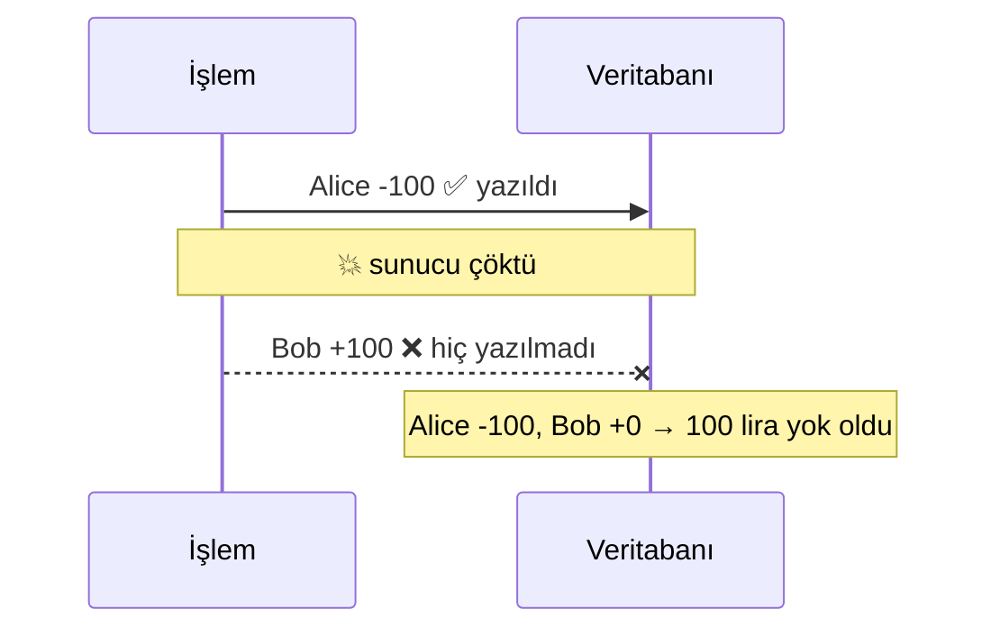
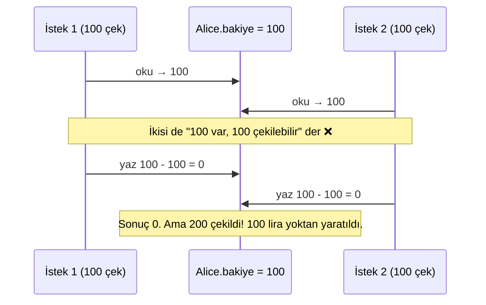
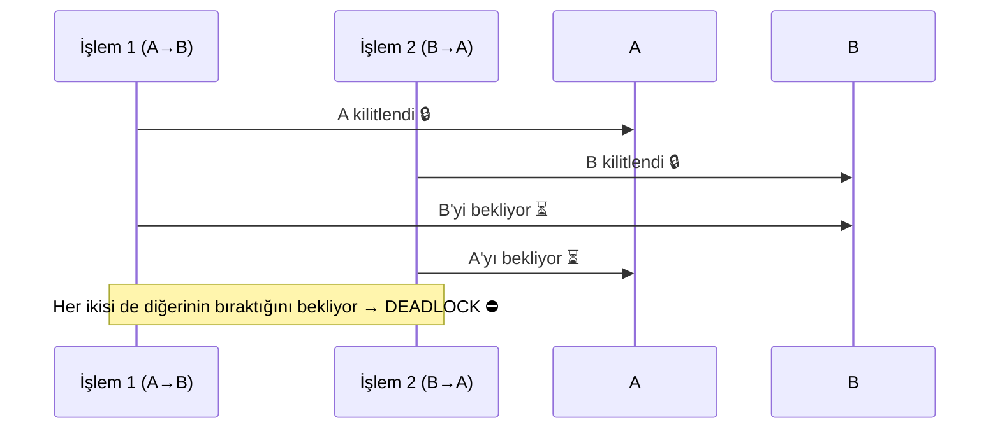
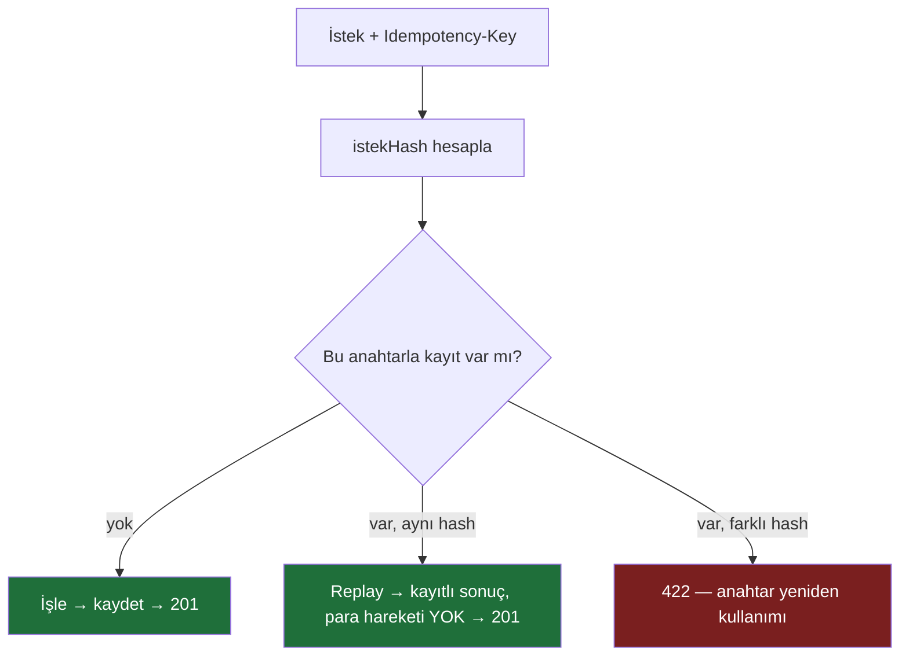
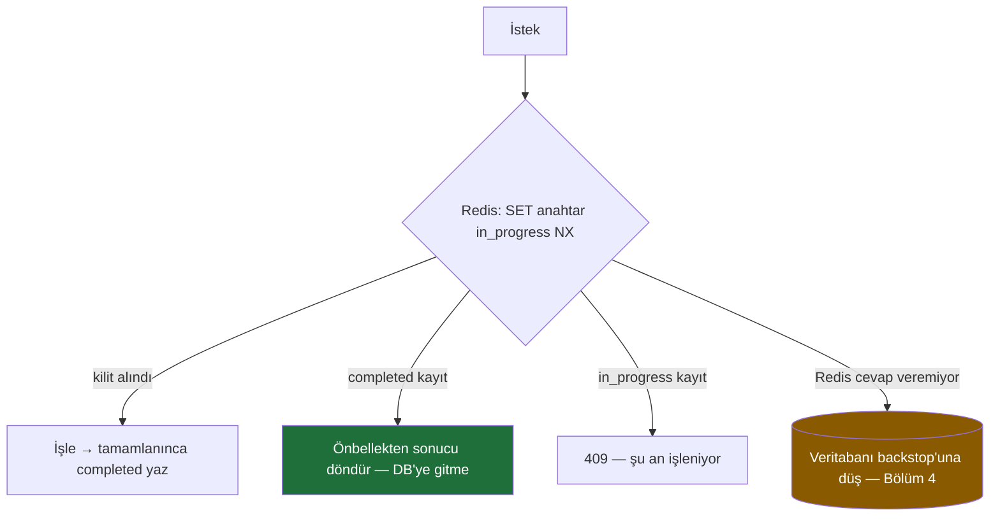
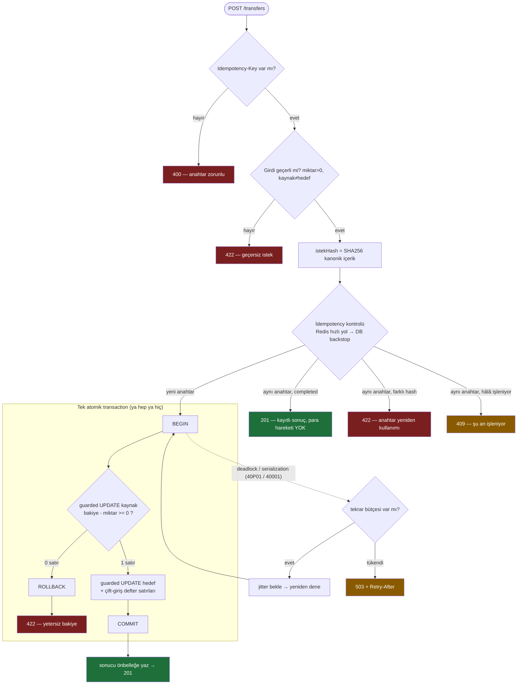

# Para Transferi Mülakat Rehberi — ACID Bir Hesapta Production-Grade Problemler

> "Bir hesaptan para düş, diğerine ekle." Bir cümle. Ama bu cümle, **gerçek bir sistemde** hayata
> geçtiğinde arkasında bir mülakatın tamamını dolduracak kadar problem saklar. Bu rehber o problemleri
> **neden/sonuç** ilkesiyle, sıfırdan, **hiç bilmeyen birine** anlatır. Her bölüm bir mülakat sorusudur:
> önce "naive (saf) cevap", sonra **neden patlar**, sonra **production-grade çözüm**.
>
> Dil/framework özelliği yoktur — anlatılan şey **mekanizma**dır (SQL, durum makinesi, retry mantığı).
> Bu repodaki kod yalnızca "kanıt" olarak gösterilir. Daha derin teknik anlatımlar:
> [race-condition.md](race-condition.md) · [idempotency.md](idempotency.md).

---

## 0. Kurulum — işlem ve oyuncular

**İşlem:** Alice'in hesabından `100` lira düş, Bob'un hesabına `100` lira ekle.

Birkaç terimi en baştan, günlük dille tanımlayalım:

- **Endpoint:** Sunucunun dışarıya açtığı bir adres/işlem. Burada `POST /transfers` — "yeni bir transfer
  oluştur" çağrısı. (**POST** = "yeni bir şey yarat/işle" anlamına gelen HTTP metodu.)
- **Bakiye (balance):** Bir hesaptaki para miktarı.
- **Transaction (işlem bütünü):** Veritabanına "şu adımların **hepsi** olsun ya da **hiçbiri** olmasın"
  diyebildiğimiz, bölünmez bir paket. Açılır (**BEGIN**), ya **COMMIT** (kalıcı yaz) ya **ROLLBACK**
  (hepsini geri al) ile kapanır.
- **Çift-giriş / double-entry:** Muhasebenin temel kuralı. Her para hareketi **en az iki satır** üretir:
  birinden eksi (`-100`), diğerine artı (`+100`). İkisinin toplamı **her zaman sıfır**dır. Para yoktan
  var olmaz/yok olmaz; sadece **yer değiştirir**.

### Neden "ACID"?

Para hesabı, veritabanı dünyasının **ACID** dediği dört garantiye sıkı sıkıya bağlıdır. Dört kelime,
dört söz:

| Harf | Söz | Günlük dille |
|---|---|---|
| **A** — Atomicity (atomiklik) | "Ya hep ya hiç." | Düşme + ekleme ya **birlikte** olur ya **hiç** olmaz. Yarım kalamaz. |
| **C** — Consistency (tutarlılık) | "Kurallar hiç bozulmaz." | Toplam para sabit; kimse kendi bakiyesinden fazlasını harcayamaz. |
| **I** — Isolation (izolasyon) | "Eş zamanlı işlemler birbirini bozmaz." | İki transfer aynı anda olsa bile sonuç, sırayla olmuş gibi doğru çıkar. |
| **D** — Durability (dayanıklılık) | "Onaylandıysa, kaybolmaz." | COMMIT dedikten sonra elektrik kesilse bile para hareketi durur. |

Bu rehberin geri kalanı tek bir iddiayı işler: **naive transfer bu dört garantinin her birini ayrı ayrı
kırar; production-grade çözümlerin her biri bunlardan birini geri kazandırır.**

> **Küçük ama kritik kural — para float değildir.** Para asla `100.10` gibi ondalıklı (`float/double`)
> tutulmaz; bilgisayarın ondalık aritmetiği yuvarlama hatası yapar ve kuruşlar kaybolur. Bunun yerine
> para **tamsayı** olarak, en küçük birimde (**minor units** — kuruş/cent) tutulur: `100.10 TL = 10010
> kuruş`. Bu rehberdeki tüm `amount` değerleri tamsayıdır.

İşte en saf hali — iki satır:

```text
Alice.bakiye = Alice.bakiye - 100
Bob.bakiye   = Bob.bakiye   + 100
```

Şimdi bir mülakatçı karşısına geçip bu iki satırı tek tek yıkacağız.

---

## 1. ❓ "Düşme yazıldı ama ekleme yazılmadan sunucu çöktü — ne olur?"

### Naive cevap neden patlar

İki satırı sırayla çalıştırıyoruz. Birinci satır işledi (Alice `-100`), tam ikinci satıra geçerken
sunucu çöktü / ağ koptu / süreç öldü. Sonuç:

- Alice'ten **100 gitti**, Bob'a **hiç gelmedi**. **100 lira buharlaştı.**
- Ters senaryoda (önce ekleme, sonra çökme) → para **yoktan var oldu**.

Bu, **Atomicity**'nin (A) çöküşüdür: işlem "yarım" kaldı.



### Production-grade çözüm: tek transaction (ya hep ya hiç)

İki yazımı **tek bir transaction** içine alırız. Veritabanı, COMMIT'e kadar hiçbir değişikliği kalıcı
yapmaz; arada bir şey patlarsa **ROLLBACK** ile *ikisini birden* geri alır.

```sql
BEGIN;                                   -- işlem bütününü aç
  UPDATE hesaplar SET bakiye = bakiye - 100 WHERE id = 'Alice';
  INSERT INTO defter (hesap, miktar) VALUES ('Alice', -100);   -- çift-giriş: eksi satır
  UPDATE hesaplar SET bakiye = bakiye + 100 WHERE id = 'Bob';
  INSERT INTO defter (hesap, miktar) VALUES ('Bob',  +100);   -- çift-giriş: artı satır
COMMIT;                                  -- ya hepsi kalıcı olur...
-- ...ya da arada hata olursa ROLLBACK → hiçbiri olmaz. Yarım transfer İMKÂNSIZ.
```

Çift-girişi de buraya kattık: her hareket bir `-` ve bir `+` defter satırı bırakır. Böylece her an
"bakiye, defter satırlarının toplamına eşit mi?" diye **kendi kendini denetleyebiliriz** (self-audit).

> **Kazandığımız ACID garantisi:** **A**tomicity (+ **D**urability: COMMIT'ten sonra kalıcı).

---

## 2. ❓ "Aynı hesaba aynı anda iki çekim gelirse?"

### Naive cevap neden patlar

Atomiklik tamam. Ama gerçek sistemde istekler **aynı anda** gelir. Naive bakiye düşürme aslında üç
adımdır: **oku → hesapla → yaz.**

Alice'in 100 lirası var. İki çekim isteği (her biri 100) aynı anda gelir:



İkisi de aynı **eski (bayat / stale)** değeri okudu. Bu boşluğa **TOCTOU** denir — *Time Of Check to
Time Of Use*, yani "kontrol ettiğim an" ile "kullandığım an" arasındaki açık. Buna **race condition**
(yarış durumu) ve sonucuna **lost update** (kayıp güncelleme) denir. Etkisi: **overspend** (bakiyenin
izin verdiğinden fazla harcama) ve `bakiye ≠ defter toplamı` — yani **Isolation** (I) çöktü.

### Production-grade çözüm: üç klasik seçenek

Mülakatta beklenen cevap "üç yolu da bil, hangisi ne zaman söyle":

**a) Pessimistic locking (kötümser kilit).** "Çakışma olacak, baştan kilitle." Satırı **kilitle**, işini
bitirene kadar kimse dokunamasın; ikinci istek **bekler**.
```sql
SELECT bakiye FROM hesaplar WHERE id = 'Alice' FOR UPDATE;  -- satırı kilitle, ikinci istek bekler
-- kilit altında güvenle kontrol et + güncelle
```
İncelik: birden çok hesabı kilitlerken **hep aynı sırada** kilitle (bkz. Bölüm 3 — deadlock).

**b) Optimistic locking / CAS (iyimser kilit).** "Çakışma nadirdir, kilitleme; yaz, çakıştıysan fark
et." Her satırda bir **versiyon** sayacı tutulur. Okuduğun versiyonla yaz; arada biri değiştirdiyse
yazım **0 satır** etkiler → **yeniden dene**. (CAS = *Compare-And-Swap*, "karşılaştır-ve-değiştir".)
```sql
-- oku: bakiye=100, versiyon=7
UPDATE hesaplar SET bakiye = 0, versiyon = 8
 WHERE id = 'Alice' AND versiyon = 7;   -- 0 satır → başkası kazandı → yeniden oku ve dene
```

**c) Atomic conditional update (koşullu güncelleme).** **En zarif.** Kontrolü ayrı adım yapma — onu
yazımın `WHERE` koşuluna **göm**. Sağdaki `bakiye`, veritabanının o an kilitlediği **canlı** değerdir;
uygulamaya hiç okunmaz, yani TOCTOU penceresi **hiç açılmaz**.
```sql
UPDATE hesaplar
   SET bakiye = bakiye - 100
 WHERE id = 'Alice'
   AND bakiye - 100 >= 0;     -- "yeterli para" kuralı koşulun İÇİNDE
-- 0 satır etkilendiyse → yetersiz bakiye (kimse eksiye düşemez)
```
İki eş zamanlı çekim, aynı satır kilidinde **sıraya girer**: ilki `100→0` yazar, ikinci *güncel* `0`
üzerinden `0 - 100 >= 0`'ı değerlendirir → tutmaz → 0 satır → reddedilir. **Overspend imkânsız.**

> **Hangisi?** Kural tek satırlık bir koşulsa (bizim durumumuz: "eksiye düşme"), **(c) koşullu
> güncelleme** en yüksek hızı verir ve varsayılan olur. Birden çok hesabı karmaşık bir kuralla birlikte
> kilitlemek gerekiyorsa **(a) pessimistic**. Çakışma çok nadirse **(b) optimistic**.
>
> **Kazandığımız ACID garantisi:** **I**solation (+ **C**onsistency: kimse eksiye düşemez).

---

## 3. ❓ "Kilit koydun; ya iki transfer birbirini beklerse?"

### Naive cevap neden patlar

Kilit, race'i çözer ama yeni bir tuzak açar. İki transfer, **iki hesaba ters sırada** dokunursa:

- İşlem 1: A→B → önce **A**'yı kilitler, sonra **B**'yi ister.
- İşlem 2: B→A → önce **B**'yi kilitler, sonra **A**'yı ister.



Bu **deadlock** (kilitlenme): herkes birbirini bekler, hiçbiri ilerleyemez. Müdahale edilmezse iki
istek de sonsuza dek asılı kalır.

### Production-grade çözüm: iki felsefe

**Önle (deadlock'u imkânsız kıl).** Tüm işlemler hesapları **hep aynı, deterministik sırada** kilitlesin
(örneğin hesap kimliğine göre küçükten büyüğe). O zaman döngüsel bekleme matematiksel olarak oluşamaz.
```text
kilitlenecek_hesaplar = sırala([A, B])   # herkes aynı sırayı kullanır → döngü yok
her hesap için: kilitle(hesap)
```

**Telafi et (deadlock'a izin ver, ucuza kurtar).** Çoğu veritabanı deadlock'u **otomatik tespit eder**
ve kurbanlardan birini özel bir hata koduyla iptal eder (PostgreSQL'de `40P01`). Biz de bu hatayı
yakalayıp **tüm işlemi yeniden deneriz** — her deneme atomik ve tam geri alınabilir olduğu için tekrar
güvenlidir. Denemeler arasına **rastgele küçük bir bekleme** (jitter) koyarız ki aynı çarpışma tekrar
olmasın.

```text
dene (en çok N kez):
    işlemi_çalıştır()                 # başarılıysa bitti
  hata "deadlock/serialization" ise:
    say(metrik)                       # gözlemlenebilirlik (aşağıda)
    bekle(rastgele küçük süre)        # jitter
    tekrar dene
  bütçe biterse:
    503 + "Retry-After: 1"            # ÇÖKME DEĞİL → "şu an yoğun, tekrar dene"
```

İki ince ama kritik nokta:

1. **Tükenince ne olur?** Aşırı çekişmede denemeler biterse, naive sistem ham bir **500 (sunucu hatası)**
   döner — sanki bir bug varmış gibi. Hata payının ASLA olmadığı bir domende bu **yanlış**: bu geçici,
   **tekrar denenebilir** bir durumdur. Doğru cevap: **503 Service Unavailable + `Retry-After` başlığı**
   — "sistem sağlam, sadece şu an yoğun, biraz sonra tekrar dene." Para asla bozulmaz: reddedilen işlem
   tamamen geri alınır.
2. **Gözlemlenebilirlik (observability).** "Deadlock oluyor mu?" diye tahmin yürütmek yerine **sayarız**:
   kaç deadlock oldu, kaçı retry ile kurtarıldı, kaçı tükendi. Böylece "deadlock gerçekten oluyor **VE**
   şeffaf biçimde telafi ediliyor" iddiası **kanıtlanabilir** hale gelir. (Bu repoda gerçek bir yük
   testinde tek koşuda **206 deadlock** ölçüldü, hepsi retry ile kurtarıldı, **0 tükenme**, para sapması
   sıfır.)

> **Kazandığımız ACID garantisi:** **I**solation'ı *yüksek eşzamanlılık altında* ayakta tutmak —
> çökmeden, veriyi bozmadan.

---

## 4. ❓ "İstek zaman aşımında tekrar gönderilirse, iki kez para gider mi?"

### Naive cevap neden patlar

Şimdiye kadar her şeyi **sunucu içinde** çözdük. Ama bambaşka bir tekrar türü var: **client'ın aynı
isteği iki kez göndermesi.**

- Ağ yavaşladı, client cevabı alamadı, emin olamadı → **tekrar gönderdi** (retry).
- Kullanıcı "Gönder" düğmesine **iki kez** bastı.

Sunucu bunu **iki ayrı geçerli istek** gibi görür → **iki ayrı transfer** → **iki kez para**. Bu bir
eşzamanlılık hatası değildir (her istek kendi içinde doğrudur); **niyet** tektir ama **çağrı** ikidir.
Sonuç yine **Consistency** (C) ihlali: kullanıcı bir kez göndermek istedi, iki kez gitti.

### Production-grade çözüm: idempotency + request hashing

**Idempotency** (eş-güçlülük): bir işlemi **bir kez ya da yüz kez** çağırmak **aynı sonucu** versin.
Bunun için client her mantıksal işlem için bir **Idempotency-Key** (benzersiz bir kimlik) üretir ve
retry'larda **aynı anahtarı** kullanır. Sunucu aynı anahtarı ikinci kez gördüğünde işlemi tekrar
**etmez**, ilk sonucu döndürür (buna **replay** denir).

> **Önemli tuzak — neden "aynı içerik = duplicate" diyemeyiz?** Çünkü para sisteminde **bilerek yapılan
> iki özdeş transfer meşrudur**: Alice, Bob'a peş peşe iki kez 100 lira gönderebilir. İçeriğe bakarak
> "aynı, demek ki kopya" dersek **meşru tekrarı yanlışlıkla bloklarız**. Bu yüzden tekrarı belirleyen
> şey **içerik değil, client'ın açık anahtarıdır.**

Peki **request hash** (istek özeti) nerede devreye girer? İçeriğin bir parmak izini (SHA-256) çıkarıp
anahtarla birlikte saklarız. Görevi tek şey: **anahtarın yanlış kullanımını yakalamak.**

```text
istekHash = SHA256( "yön | kaynak | hedef | miktar | açıklama" )
# DİKKAT: sunucu zamanı (timestamp) hash'e GİRMEZ — her çağrıda değişir, dedup hiç tetiklenmez.
```

- **SHA-256:** Bir metni geri döndürülemez, sabit uzunlukta bir parmak izine çeviren özet (hash)
  fonksiyonu. Aynı girdi → aynı çıktı; girdi bir karakter değişse → bambaşka çıktı.

Karar tablosu:

| Durum | Karar | HTTP |
|---|---|---|
| Bu anahtar **hiç görülmedi** | İşle | → 201 |
| Aynı anahtar + **aynı** içerik (hash eşleşir) | **Replay** — ilk sonucu döndür, yeni para hareketi YOK | → 201 |
| Aynı anahtar + **farklı** içerik (hash farklı) | **Reddet** — anahtar yanlış kullanılmış | → 422 |
| Aynı anahtar, ilk istek **hâlâ işleniyor** | Reddet — şu an sürüyor | → 409 |

**Kontrol nasıl yapılır (sözde kod).** İki adım: önce içeriğin parmak izini çıkar, sonra anahtara göre
geçmişe bak ve hash'i karşılaştır:

```text
# 1) İçeriğin parmak izi — sunucu zamanı GİRMEZ (yoksa her retry farklı hash üretir, dedup hiç tetiklenmez)
istekHash = SHA256("transfer | " + kaynak + " | " + hedef + " | " + miktar + " | " + açıklama)

# 2) Bu anahtarla daha önce işlenmiş bir transfer var mı?
kayit = bul(transferler, idempotency_key = gelenAnahtar)

if kayit == yok:
    # ilk kez görülüyor → işle ve anahtarı + hash'i transfer'le birlikte sakla
    işle_ve_kaydet(idempotency_key = gelenAnahtar, request_hash = istekHash)   # → 201
elif kayit.request_hash == istekHash:
    return kayit.sonuç          # aynı anahtar + AYNI içerik → REPLAY (yeni para hareketi YOK) → 201
else:
    return 422 "idempotency_key_reuse"   # aynı anahtar + FARKLI içerik → reddet
```

Dikkat: `request_hash` karşılaştırması, anahtarın **doğru** kullanıldığını doğrular. Eşleşiyorsa "gerçek
bir retry" → ilk sonucu aynen ver. Eşleşmiyorsa "aynı anahtar farklı işe yapıştırılmış" → güvenlik için
reddet. Asıl tekrarı belirleyen şey **anahtar**, hash yalnızca **muhafız**dır.



### "Sadece key yetmez mi?" — request hashing'in çözdüğü gerçek problem

Sezgisel bir itiraz: "Aynı anahtar gelince ikinci işlem zaten yapılmıyor; o zaman hash neyi değiştiriyor?"
Haklı bir nokta — ama yalnızca **içerik aynıyken**. Fark, "aynı anahtar + **farklı** içerik" durumunda
ortaya çıkar ve orada hash, **sessiz bir para hatasını** önler.

Hash **olmasaydı**, sistem "anahtarı gördüm → demek ki istek aynı" diye **varsayardı** ve körlemesine ilk
sonucu döndürürdü. Somut senaryo (gerçek bir client bug'ı):

```text
1) Client x1 ile "Bob'a 100 gönder"  → işlenir, txId = T1   (Bob +100)
2) Client BUG: x1'i yeniden kullanır → "Carol'a 5000 gönder"
   • Hash YOK  → sunucu x1'i görür, T1'i replay eder → client'a "başarılı, txId=T1" döner
                → Client loglar: "Carol'a 5000 gönderildi ✓"   ❌ ama Carol'a HİÇBİR ŞEY gitmedi!
   • Hash VAR  → h2 ≠ h1 → 422 idempotency_key_reuse → bug ANINDA yüzeye çıkar, state bozulmaz ✓
```

Hash olmadan iki seçenek de yanlıştır: (a) ilk sonucu replay et → client yeni isteğinin başarılı
olduğunu **sanır** (oysa eski sonucu aldı); (b) ikinciyi de işle → idempotency çöker, iki transfer olur.
Hash, doğru üçüncü yolu açar: **çelişkiyi tespit edip reddet.**

| Durum | Sadece key (hash yok) | Key + request hash |
|---|---|---|
| Aynı key + **aynı** içerik | Replay ✓ | Replay ✓ (**fark yok**) |
| Aynı key + **farklı** içerik | İlk sonucu **sessizce** replay → **yanlış** ❌ | **422 reddet** ✓ |

Özet — iki ayrı soru, iki ayrı araç:

- **Idempotency key** şunu yanıtlar: *"Bu anahtarı daha önce gördüm mü?"*
- **Request hash** şunu yanıtlar: *"Bu anahtarın altındaki şey, şimdi gelen istekle gerçekten aynı mı?"*

Hash olmadan ikincisini **varsayarsın** (client her farklı işleme taze anahtar üretir diye güvenirsin).
Hash o varsayımı **doğrular** — ve client'lar gerçek dünyada anahtarı yanlış yönettiği için (kopyala-yapıştır,
oturuma bağlı sabit anahtar, retry kütüphanesi bug'ı) bu doğrulama sessiz para sapmalarını yakalar. Stripe,
PayPal gibi sistemler de bu yüzden anahtarın yanında içerik parmak izi saklar.

**Kalıcı garanti — DB backstop.** Bu kontrolü "önce bakıp sonra yazmak" yine bir yarış açar (iki kopya
aynı anda "kayıt yok" görebilir). Son emniyet kemeri veritabanındadır: anahtar sütununa bir **benzersiz
(unique) indeks** koyarız. İki kopya aynı yeni anahtarla yazmaya kalkarsa, veritabanı ikincisini
**fiziksel olarak reddeder** → 409. Yani "anahtar başına en fazla bir transfer" garantisini *uygulama
mantığına değil, veritabanına* yaptırırız.

> **Kazandığımız ACID garantisi:** **C**onsistency — bir niyet, bir hareket.

---

## 5. ❓ "Bunu veritabanına hiç uğramadan, ölçekte nasıl yaparsın?"

### Naive cevap neden zayıf

Bölüm 4'teki çözüm doğrudur ama her tekrarlanan istek yine de veritabanına bir sorgu maliyeti çıkarır;
ve eş zamanlı kopya net bir "şu an işleniyor" sinyali görmez. Saldırgan bir client saniyede binlerce
tekrar gönderirse, hepsi DB'ye kadar gider.

### Production-grade çözüm: hızlı bir önbellek katmanı (Redis) + durum makinesi

Veritabanının önüne çok hızlı bir hafıza-içi depo (örn. **Redis**) koyarız ve anahtar başına küçük bir
**durum makinesi** işletiriz:

- **`SET anahtar in_progress NX EX 30s`** — *NX* = "yalnızca yoksa yaz" (atomik kilit alma). İlk istek
  kilidi kapar ve işler. (*EX* = sona erme süresi; süreç ortada ölürse kilit kendi kendine açılır.)
- İş bitince kilidi **`completed` + sonucun kopyası** ile değiştiririz (kısa süreli yanıt önbelleği).
- Bu sırada gelen kopya:
  - `in_progress` görürse → **409** ("şu an işleniyor").
  - `completed` görürse → **kayıtlı sonucu döndürür** — DB'ye hiç uğramadan.

**Sözde kod (durum makinesi + graceful degradation):**

```text
try:
    sonuç = REDIS.SET("idem:" + anahtar, {hash, "in_progress"}, NX, EX=30s)   # NX = yalnızca yoksa yaz
    if sonuç == OK:                       # kilidi BİZ aldık → ilk istek
        cevap = işle()
        REDIS.SET("idem:" + anahtar, {hash, "completed", cevap}, EX=24h)   # sonucu önbelleğe yaz
        return cevap
    else:                                 # kayıt zaten var → oku ve karar ver (DB'ye uğramadan)
        kayit = REDIS.GET("idem:" + anahtar)
        if kayit.hash != hash:            return 422   # anahtar yeniden kullanımı
        if kayit.durum == "completed":    return kayit.cevap   # REPLAY — hızlı yol
        if kayit.durum == "in_progress":  return 409           # şu an işleniyor
except RedisHatası:
    # Redis yok/çöktü → bu katmanı ATLA, doğrudan veritabanı backstop'una düş (Bölüm 4).
    # Sistem bozulmaz, sadece bu istek için biraz daha yavaş çalışır.
    pass
```

Tek bir satır bile fazladan korumasız kalmaz: `except` bloğu, Redis'in **hiç olmadığı** durumda sistemin
Bölüm 4'teki veritabanı garantisiyle aynen çalışmasını sağlar.



**En kritik tasarım kuralı — Redis doğruluğun kaynağı DEĞİLDİR; sadece hızlandırıcıdır.** Redis çökerse
ya da bir anahtarı silerse, sistem **bozulmaz**: Bölüm 4'teki **veritabanı backstop'u** devreye girer.
Buna **graceful degradation** (zarif gerileme) denir — bir bileşen düşse de sistem doğru çalışmaya,
yalnızca biraz daha yavaş, devam eder.

Bu yüzden production-grade sıralama her zaman aynıdır: **önce doğruluk (veritabanı), sonra performans
(önbellek).** Performans katmanını, doğruluğu ona *bağımlı kılmadan* eklersin.

> **Kazandığımız ACID garantisi:** Aynı **C**onsistency garantisini **ölçekte ve ucuza** sunmak —
> doğruluğu riske atmadan.

---

## 6. ❓ Özet: "Asla hata kabul etmeyen bir para-hareketi POST'unun minimum zorunlulukları nelerdir?"

İki satırlık naive koddan yola çıktık; her mülakat sorusu bir katman ekledi. İşte minimum kontrol
listesi ve her maddenin koruduğu ACID garantisi:

| # | Zorunluluk | Çözdüğü problem | Korunan ACID |
|---|---|---|---|
| 1 | **Tek atomik transaction** (ya hep ya hiç) | Yarım transfer | **A** + **D** |
| 2 | **Çift-giriş** (toplam sıfır, self-audit) | Para yoktan var olur/yok olur | **C** |
| 3 | **Guarded/koşullu güncelleme** (kural `WHERE`'de) | Race condition / lost update / overspend | **I** + **C** |
| 4 | **Deadlock tespiti + bounded jitter retry** | Çapraz kilit / sonsuz bekleme | **I** |
| 5 | **Tükenmede temiz `503 + Retry-After`** (ham 500 değil) | Aşırı yükte "çöktü" yanılgısı | **I** |
| 6 | **Idempotency-Key + request hash** | Tekrarlanan istek → çift para | **C** |
| 7 | **DB unique index backstop** | "Önce bak sonra yaz" yarışı | **C** |
| 8 | **Önbellek hızlandırma + graceful degradation** | Ölçek / DB yükü, bileşen arızası | **C** (ölçekte) |
| 9 | **Para = tamsayı (minor units)** | Yuvarlama hatası, kayıp kuruş | **C** |

### Önce / sonra

```text
NAIVE (2 satır):
  Alice -= 100
  Bob   += 100
  → yarım kalır, eşzamanlı ezilir, tekrarlanır, kilitlenir. Dört ACID garantisi de açık.

PRODUCTION-GRADE:
  Idempotency-Key + hash kontrolü  →  (Redis hızlı yol → DB backstop)
    → BEGIN transaction
        → guarded UPDATE (kaynak)  [race-safe; yetersizse reddet]
        → guarded UPDATE (hedef)
        → çift-giriş defter satırları
      COMMIT
    → deadlock/çekişme olursa: bounded jitter retry; tükenirse 503 + Retry-After
  → başarıda sonucu önbelleğe yaz; idempotent replay için sakla
```

### Tam akış — tek bir `POST /transfers` baştan sona

Tüm katmanlar tek diyagramda. Yeşil = başarı; sarı = geçici/tekrar denenebilir; kırmızı = kalıcı reddetme.



Üç katman tek nefeste okunuyor: **kapı** (anahtar + girdi doğrulama) → **idempotency** (Redis hızlı yol,
DB backstop) → **atomik motor** (guarded update + çift-giriş + deadlock retry/503). Yalnızca "yeni anahtar
+ geçerli + yeterli bakiye + çekişmeyi atlatan" istek COMMIT'e ulaşır; diğer her yol **deterministik,
doğru** bir cevapla kapanır.

Aynı "bir cümlelik" işlem; ama artık **dört ACID garantisini de** sunan, hata payının olmadığı bir
yapı. Mülakatta beklenen şey de tam budur: iki satırın neden yetmediğini ve her katmanın **hangi
somut felaketi** önlediğini, neden/sonuç zinciriyle anlatabilmek.

---

## 7. Terim sözlüğü

- **ACID:** Bir veritabanı işleminin dört garantisi — Atomicity (atomiklik), Consistency (tutarlılık),
  Isolation (izolasyon), Durability (dayanıklılık).
- **Transaction (işlem bütünü):** "Hepsi ya da hiçbiri" olan, BEGIN ile açılıp COMMIT/ROLLBACK ile
  kapanan bölünmez paket.
- **Commit / Rollback:** Sırasıyla "değişiklikleri kalıcı yap" / "hepsini geri al".
- **Double-entry (çift-giriş):** Her hareketin bir eksi + bir artı satır üretmesi; toplam her zaman 0.
- **Race condition (yarış durumu):** Eş zamanlı işlemlerin aynı veriyi okuyup-yazarak sonucu bozması.
- **Lost update (kayıp güncelleme):** Eş zamanlı yazımlardan birinin diğerini ezmesi.
- **TOCTOU:** "Kontrol ettiğim an" ile "kullandığım an" arasındaki tehlikeli boşluk.
- **Overspend:** Bakiyenin izin verdiğinden fazla para çıkması (negatife düşme).
- **Pessimistic / Optimistic locking:** "Baştan kilitle" / "yaz, çakışırsan fark et ve yeniden dene".
- **CAS (Compare-And-Swap):** Versiyon eşleşiyorsa yaz, eşleşmiyorsa çakışma → retry.
- **Deadlock (kilitlenme):** İki işlemin karşılıklı, birbirinin kilidini sonsuza dek beklemesi.
- **Idempotency (eş-güçlülük):** Aynı işlemi 1 veya N kez çağırmanın aynı sonucu vermesi.
- **Idempotency-Key:** Client'ın bir mantıksal işlem için ürettiği, retry'larda sabit kalan benzersiz kimlik.
- **Hash / SHA-256:** Bir metni geri döndürülemez sabit-uzunluk parmak izine çeviren fonksiyon.
- **Backstop:** Üst katman (önbellek) başarısız olsa bile doğruluğu garanti eden son emniyet (DB unique index).
- **Graceful degradation (zarif gerileme):** Bir bileşen düşse de sistemin doğru, sadece daha yavaş çalışması.
- **Minor units:** Paranın en küçük biriminde tamsayı gösterimi (kuruş/cent) — float yerine.
- **409 / 422 / 503:** "çakışma/şu an işleniyor" / "girdi geçersiz veya anahtar yeniden kullanıldı" /
  "geçici olarak meşgul, tekrar dene".

---

*Daha derin, koda inen anlatımlar: [race-condition.md](race-condition.md) (dört eşzamanlılık stratejisi
yan yana) ve [idempotency.md](idempotency.md) (DB + Redis iki katman). Bu rehber onların kavramsal,
mülakat-odaklı giriş kapısıdır.*
