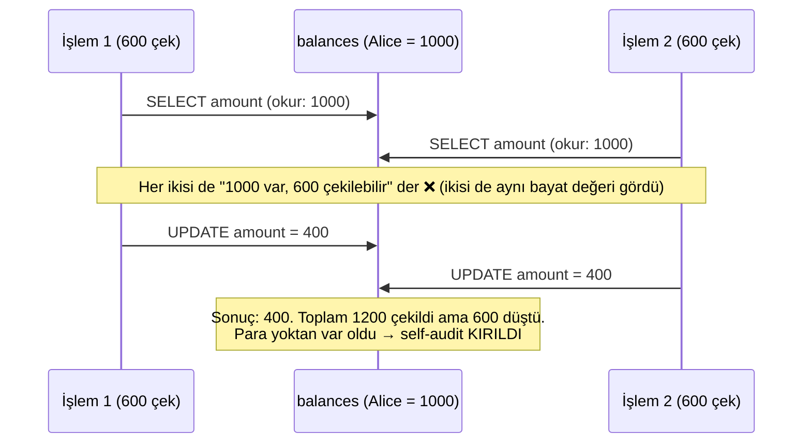
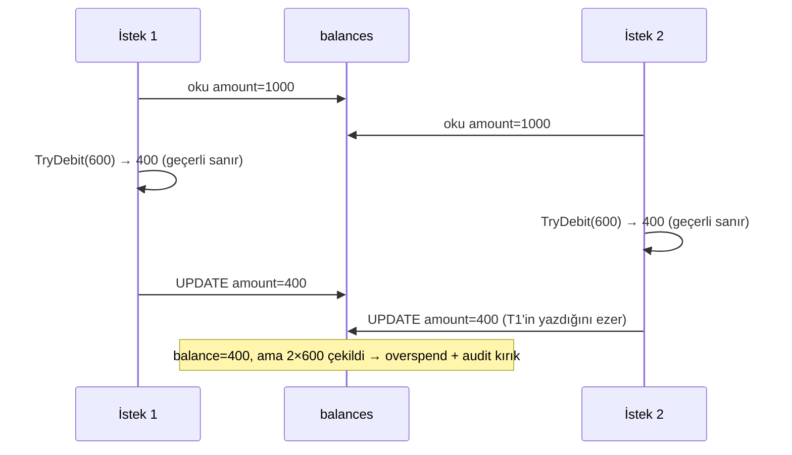
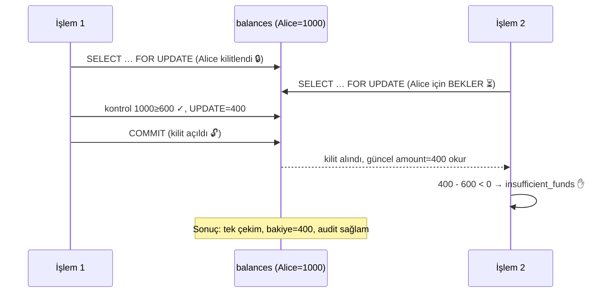
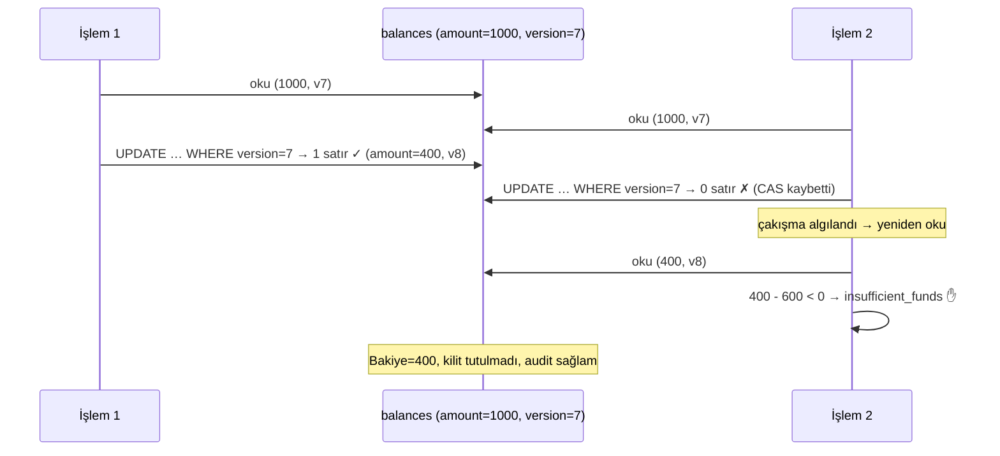
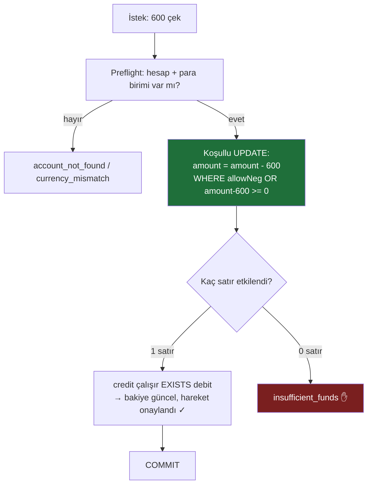
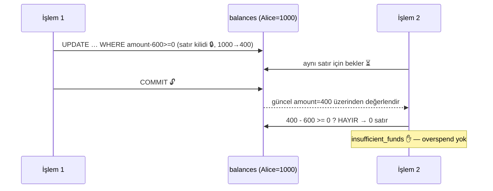

# Race Condition — Para Transferinde Eş Zamanlılığın Yönetimi

> Öğretici rehber. Para transferi gibi **hata kabul etmeyen** sistemlerde race condition'dan
> nasıl kaçınıldığını, bu projedeki dört gerçek `IBalanceMutator` implementasyonu üzerinden
> adım adım anlatır. Yan kaynaklar: kısa karşılaştırma için
> [concurrency-strategies.md](concurrency-strategies.md), mimari karar için
> [adr-0001-concurrency-strategy.md](adr-0001-concurrency-strategy.md).

---

## Özet

Bir **race condition** (yarış durumu), iki veya daha fazla işlemin aynı veriyi eş zamanlı
okuyup-yazması ve sonucun işlemlerin sırasına bağlı olarak bozulmasıdır. Bir bakiye üzerinde
bu, klasik **lost update** (kayıp güncelleme) problemine dönüşür:

- İki çekim aynı bakiyeyi (`1000`) okur,
- ikisi de "yeterli para var" der,
- ikisi de `1000 - 600 = 400` yazar,
- sonuç: **iki kez 600 çekildi ama bakiyeden yalnızca 600 düştü** → para yoktan var oldu.

Para sisteminde bunun bedeli ağırdır:

| Belirti | Anlamı |
|---|---|
| **overspend** | Bakiyenin izin verdiğinden fazla para çekilir (negatife düşer). |
| **lost update** | Eş zamanlı yazımlardan biri diğerini ezer, hareket "kaybolur". |
| **`balance ≠ Σ(ledger entries)`** | Bakiye projeksiyonu defter kayıtlarıyla tutmaz → **self-audit kırılır**. |

Bu projede para hareketinin **tek kritik adımı** olan bakiye mutasyonu,
[`IBalanceMutator`](../src/MoneyTransfer.Api/Infrastructure/Movement/MovementContracts.cs)
arabirimi arkasına alınmıştır. Böylece "yarışı nasıl önlüyoruz?" sorusunun cevabı tek bir
yerde, değiştirilebilir bir strateji olarak yaşar:

```csharp
public interface IBalanceMutator
{
    Task<MutationResult> ApplyAsync(LedgerDbContext db, MovementCommand cmd, CancellationToken ct);
}
```

Dört implementasyon vardır — **Naive** (güvensiz, hatayı göstermek için),
**Pessimistic** (kilitleyici), **Optimistic** (versiyonlu/CAS) ve **Conditional** (koşullu,
**varsayılan**). Hepsi aynı transaction içinde çalışır; yalnızca *debiti güvende tutma yöntemleri*
farklıdır.

---

## Ortak Problem: Read-Modify-Write Penceresi (TOCTOU)

Naif yaklaşım üç adımdan oluşur: **oku → hesapla → yaz**. Sorun, "oku" ile "yaz" arasındaki
zaman aralığıdır — buna **TOCTOU** (Time Of Check to Time Of Use, *kontrol anı ile kullanım anı
arası*) denir. Bu pencere içinde başka bir işlem aynı satırı değiştirirse, bizim hesabımız
**bayat (stale)** veriye dayanır.

Çekirdek kuralımız (invariant) tek cümleliktir:

> `allows_negative` değilse, bir hesabın bakiyesi **sıfırın altına inemez**.

Aşağıdaki diyagram, iki eş zamanlı çekimin bu pencereden nasıl sızdığını gösterir:



Aşağıdaki dört yöntem, bu pencereyi farklı biçimlerde kapatır (veya Naive örneğinde,
**kapatmadığında** ne olduğunu gösterir).

---

## 1. NaiveMutator — Senkronizasyonsuz Erişim (⚠ Güvensiz, yalnızca demo)

### Çalışma prensibi

En basit ve **en tehlikeli** yaklaşım. Bakiyeyi ORM (EF Core) ile okur, domain nesnesi üzerinde
hesaplar (`TryDebit`/`Credit`), ardından `SaveChanges` sıradan bir `UPDATE` üretir. **Hiçbir
kilit yok, hiçbir versiyon kontrolü yok.** Tam olarak yukarıdaki TOCTOU penceresini açık bırakır.

Bu projede bilerek tutulur: yarışın gerçekten oluştuğunu K6 testiyle **kanıtlamak** için.
Asla production'da kullanılmaz.

### Kod örneği (Türkçe yorumlu)

```csharp
// ⚠ GÜVENSİZ — yalnızca yarışı göstermek için.
public async Task<MutationResult> ApplyAsync(LedgerDbContext db, MovementCommand cmd, CancellationToken ct)
{
    // 1) OKU — bakiyeyi EF ile çek (kilit yok)
    var kaynak = await db.Accounts.Include(a => a.Balance).FirstOrDefaultAsync(a => a.Id == cmd.FromId, ct);
    var hedef  = await db.Accounts.Include(a => a.Balance).FirstOrDefaultAsync(a => a.Id == cmd.ToId, ct);
    if (kaynak is null || hedef is null) return MutationResult.Fail(MutationStatus.AccountNotFound);
    if (kaynak.Currency != hedef.Currency) return MutationResult.Fail(MutationStatus.CurrencyMismatch);

    var now = DateTimeOffset.UtcNow;

    // 2) HESAPLA — bellekteki (muhtemelen bayat) değere göre kontrol et
    if (!kaynak.TryDebit(cmd.Amount, now))           // "yeterli mi?" — ama okuduğumuz an geçti
        return MutationResult.Fail(MutationStatus.InsufficientFunds);
    hedef.Credit(cmd.Amount, now);

    // 3) YAZ — SaveChanges sıradan bir UPDATE atar; araya giren değişikliği fark etmez
    return MutationResult.Applied(kaynak.Balance.Amount, hedef.Balance.Amount);
}
```

> Gerçek kaynak: [NaiveMutator.cs](../src/MoneyTransfer.Api/Infrastructure/Movement/NaiveMutator.cs)

### Para transferi örneği

Alice'in bakiyesi `1000`. İki istek aynı anda 600'er çekmeye çalışır. İkisi de `1000` okur,
ikisi de geçer, ikisi de `400` yazar. Alice 1200 harcadı ama bakiyesi yalnızca `400` gösteriyor
— oysa `-200` olmalıydı (ve bu hesapta negatif yasak). Defter iki çekim kaydı tutar ama
bakiye onlarla tutmaz → **`balance ≠ Σ entries`**.

### Neden başarısız olur



### Performans / güvenlik dengesi

- **Performans:** En hızlı görünür (kilit yok, ekstra round-trip yok).
- **Güvenlik:** **Sıfır.** Eş zamanlılık altında veri bozar. Tek kullanıcılı/çekişmesiz
  senaryolar dışında **asla** kullanılmaz; burada sadece eğitim amaçlıdır.

---

## 2. PessimisticMutator — Kilitleyici Yaklaşım (`SELECT … FOR UPDATE`)

### Çalışma prensibi

"Kötümser" varsayım: *çakışma olacak, o yüzden baştan kilitle.* İlgili bakiye satırlarını
`SELECT … FOR UPDATE` ile kilitler. Kilit, transaction bitene kadar tutulur; aynı satıra
ulaşmak isteyen ikinci işlem **bekler**. Böylece kontrol ve yazım, başka kimsenin araya
giremeyeceği bir kritik bölümde gerçekleşir — TOCTOU penceresi kapanır.

İki incelik (sessiz tuzaklar):

- **DISTINCT id:** Aynı hesabı IN listesinde iki kez kilitlemeye çalışmamak.
- **`ORDER BY account_id`:** Tüm işlemler satırları **aynı sırada** kilitlesin → karşılıklı
  bekleme (deadlock) oluşmaz.

### Kod örneği (Türkçe yorumlu)

```csharp
public async Task<MutationResult> ApplyAsync(LedgerDbContext db, MovementCommand cmd, CancellationToken ct)
{
    var (conn, tx) = db.GetDapperContext();              // EF ile paylaşılan bağlantı/transaction
    var idler = new[] { cmd.FromId, cmd.ToId }.Distinct().ToArray();  // çift kilit yok

    // KİLİTLE — satırları deterministik sırada kilitle; ikinci işlem burada bekler
    var kilitli = (await conn.QueryAsync<Row>(new CommandDefinition(
        """
        SELECT b.account_id AS AccountId, b.amount AS Amount, a.currency AS Currency, a.allows_negative AS AllowsNegative
        FROM balances b JOIN accounts a ON a.id = b.account_id
        WHERE b.account_id = ANY(@ids)
        ORDER BY b.account_id      -- tutarlı sıra → deadlock yok
        FOR UPDATE                 -- satırları transaction boyunca kilitle
        """, new { ids = idler }, transaction: tx, cancellationToken: ct))).ToList();

    var kaynak = kilitli.FirstOrDefault(r => r.AccountId == cmd.FromId);
    var hedef  = kilitli.FirstOrDefault(r => r.AccountId == cmd.ToId);
    if (kaynak is null || hedef is null) return MutationResult.Fail(MutationStatus.AccountNotFound);
    if (kaynak.Currency != hedef.Currency) return MutationResult.Fail(MutationStatus.CurrencyMismatch);

    // KONTROL — kilit altında, kimse değiştiremez, güvenle kontrol et
    if (!kaynak.AllowsNegative && kaynak.Amount - cmd.Amount < 0)
        return MutationResult.Fail(MutationStatus.InsufficientFunds);

    // YAZ — iki bakiyeyi de güncelle; commit kilitleri serbest bırakır
    var yeniKaynak = kaynak.Amount - cmd.Amount;
    var yeniHedef  = hedef.Amount + cmd.Amount;
    await conn.ExecuteAsync(new CommandDefinition(
        "UPDATE balances SET amount = @amount, version = version + 1, updated_at = now() WHERE account_id = @id",
        new[] { new { id = cmd.FromId, amount = yeniKaynak }, new { id = cmd.ToId, amount = yeniHedef } },
        transaction: tx, cancellationToken: ct));

    return MutationResult.Applied(yeniKaynak, yeniHedef);
}
```

> Gerçek kaynak: [PessimisticMutator.cs](../src/MoneyTransfer.Api/Infrastructure/Movement/PessimisticMutator.cs)

### Para transferi örneği

Alice (`1000`) → Bob. İki çekim aynı anda gelir. İlk işlem Alice'in satırını kilitler,
`1000` görür, `400` yazar, commit eder. İkinci işlem **kilidin açılmasını bekler**, sonra
*güncel* `400` değerini görür → `400 - 600 < 0` → `insufficient_funds`. Overspend imkânsız.

### Çakışma çözümü (kilit bekleme)



### Performans / güvenlik dengesi

- **Güvenlik:** Çok güçlü; akıl yürütmesi en kolay olan yöntem. Çok-satırlı karmaşık kurallar
  için idealdir (birden çok bakiyeyi tek kuralla kilitlemek).
- **Performans:** Kilit transaction boyunca tutulur → **sıcak hesapta** (aynı satıra yoğun
  erişim) bekleyenler birikir, throughput düşer. Yanlış kilit sırası deadlock doğurur (burada
  `ORDER BY` ile engellenmiştir).
- **Ne zaman?** Tek transaction'da birkaç bakiyeyi karmaşık bir kuralla beraber kilitlemen
  gerektiğinde.

---

## 3. OptimisticMutator — İyimser Yaklaşım (Versiyonlama / CAS)

### Çalışma prensibi

"İyimser" varsayım: *çakışma nadirdir, o yüzden kilitleme — yaz, sonra çakıştıysan fark et.*
Her bakiye satırında bir `version` sütunu tutulur. İşlem `amount` ve `version`'ı okur, yeni
değeri hesaplar ve **`WHERE version = @okunan_versiyon`** koşuluyla yazar. Bu, klasik
**CAS** (Compare-And-Swap, *karşılaştır-ve-değiştir*) desenidir:

- UPDATE **1 satır** etkilediyse → arada kimse değiştirmedi, başarılı.
- UPDATE **0 satır** etkilediyse → başka biri versiyonu artırmış (bizim okuduğumuz bayat
  kaldı) → **yeniden oku ve dene** (sınırlı sayıda retry).

Hiç kilit tutulmaz; çekişmeyi "yarışı kaybedeni yeniden denetterek" çözer.

### Kod örneği (Türkçe yorumlu)

```csharp
// DEBIT — CAS döngüsü: kaybedersen yeniden oku ve dene
long yeniKaynak = 0;
var basarili = false;
for (var deneme = 0; deneme <= _maxRetries && !basarili; deneme++)
{
    // OKU — güncel amount + version
    var satir = await conn.QuerySingleAsync<VersionedBalance>(new CommandDefinition(
        "SELECT amount AS Amount, version AS Version FROM balances WHERE account_id = @id",
        new { id = cmd.FromId }, transaction: tx, cancellationToken: ct));

    // KONTROL — yetersizse retry'a gerek yok, temiz hata
    if (!kaynak.AllowsNegative && satir.Amount - cmd.Amount < 0)
        return MutationResult.Fail(MutationStatus.InsufficientFunds);

    yeniKaynak = satir.Amount - cmd.Amount;

    // YAZ — yalnızca version okuduğumuzla AYNIYSA (kimse araya girmediyse)
    var etkilenen = await conn.ExecuteAsync(new CommandDefinition(
        "UPDATE balances SET amount = @newAmount, version = version + 1, updated_at = now() " +
        "WHERE account_id = @id AND version = @ver",   // ← CAS koşulu
        new { id = cmd.FromId, newAmount = yeniKaynak, ver = satir.Version }, transaction: tx, cancellationToken: ct));

    basarili = etkilenen == 1;   // 0 satır → başkası kazandı → döngü tekrar okur ve dener
}
if (!basarili)
    throw new ConcurrencyConflictException($"CAS debit {_maxRetries} denemede yakınsamadı: {cmd.FromId}");
// (credit için simetrik bir CAS döngüsü daha çalışır)
```

> Gerçek kaynak: [OptimisticCasMutator.cs](../src/MoneyTransfer.Api/Infrastructure/Movement/OptimisticCasMutator.cs)
> — `version` aynı zamanda balance API'sinin döndürdüğü token'dır.

### Para transferi örneği

Alice (`1000`, version=`7`). İki çekim aynı anda okur (ikisi de version=7 görür). İlki
`amount=400, version=8` yazar (`WHERE version=7` → 1 satır, başarılı). İkincinin
`WHERE version=7` koşulu artık **0 satır** etkiler (version 8 oldu) → ikinci **yeniden okur**,
bu kez `400, version=8` görür → `400 - 600 < 0` → `insufficient_funds`. Yine overspend yok.

### Çakışma çözümü (CAS başarısız → retry)



### Performans / güvenlik dengesi

- **Güvenlik:** Tam; kilit olmadan doğruluk sağlar.
- **Performans:** **Düşük çekişmede** mükemmel — kilit beklemesi yok, okuma-yoğun yüke iyi
  ölçeklenir. **Yüksek çekişmede** ise retry'lar boşa iş yaratır (hatta livelock riski);
  bu yüzden retry bütçesi sınırlıdır (`MaxConcurrencyRetries`), tükenince çağıran katmana
  geçici çakışma olarak iletilir.
- **Ne zaman?** Çakışmanın **nadir** olduğu, okumaların baskın olduğu senaryolar.

---

## 4. ConditionalMutator — Koşullu Yaklaşım (VARSAYILAN)

### Çalışma prensibi

En zarif yöntem: **kontrolü ayrı bir adım yapma — onu yazımın `WHERE` koşuluna göm.**
"Önce oku, sonra karar ver" yerine, veritabanına *tek bir koşullu UPDATE* gönderilir:

```sql
UPDATE balances SET amount = amount - @amt
WHERE account_id = @from AND (@allowNeg OR amount - @amt >= 0)
```

Buradaki dahiyane nokta: sağ taraftaki `amount`, PostgreSQL'in o satırı güncellerken
**kilitlediği canlı değerdir** — uygulamaya hiç okunmaz. Yani read-modify-write penceresi
**hiç açılmaz** (TOCTOU yok). Koşul tutmazsa (yetersiz bakiye) UPDATE **0 satır** etkiler.

Bu projede bir adım daha ileri gidilmiştir: debit ve credit **tek SQL ifadesinde**, bir CTE
(Common Table Expression) ile yapılır. Credit yalnızca debit bir satır ürettiyse çalışır
(`WHERE EXISTS (SELECT 1 FROM debit)`) → **debit olmadan credit yapmak yapısal olarak imkânsız**
(para yoktan yaratılamaz). Atomiklik yalnızca transaction düzeyinde değil, **ifade düzeyinde**
de garanti altına alınır.

### Kod örneği (Türkçe yorumlu)

```csharp
public async Task<MutationResult> ApplyAsync(LedgerDbContext db, MovementCommand cmd, CancellationToken ct)
{
    var (conn, tx) = db.GetDapperContext();

    // PREFLIGHT — varlık + para birimi (bizim işlemlerimizde değişmeyen sabitler, kilitsiz okunur).
    // Bu, "0 satır"ı "hesap yok" ile "yetersiz bakiye"den ayırt etmemizi sağlar.
    var meta = (await conn.QueryAsync<Meta>(new CommandDefinition(
        "SELECT id AS Id, currency AS Currency, allows_negative AS AllowsNegative FROM accounts WHERE id = ANY(@ids)",
        new { ids = new[] { cmd.FromId, cmd.ToId } }, transaction: tx, cancellationToken: ct))).ToList();
    var kaynak = meta.FirstOrDefault(m => m.Id == cmd.FromId);
    var hedef  = meta.FirstOrDefault(m => m.Id == cmd.ToId);
    if (kaynak is null || hedef is null) return MutationResult.Fail(MutationStatus.AccountNotFound);
    if (kaynak.Currency != hedef.Currency) return MutationResult.Fail(MutationStatus.CurrencyMismatch);

    // KORUMALI DEBIT + BAĞLI CREDIT — tek ifade (CTE):
    //   debit'in WHERE'i invariant'ı CANLI kilitli değere karşı uygular (yarış-güvenli).
    //   credit yalnızca debit bir satır ürettiyse çalışır → debitsiz credit imkânsız.
    var row = await conn.QuerySingleAsync<MovementRow>(new CommandDefinition(
        """
        WITH debit AS (
            UPDATE balances SET amount = amount - @amt, version = version + 1, updated_at = now()
            WHERE account_id = @fromId AND (@allowNeg OR amount - @amt >= 0)   -- invariant WHERE'de
            RETURNING amount
        ),
        credit AS (
            UPDATE balances SET amount = amount + @amt, version = version + 1, updated_at = now()
            WHERE account_id = @toId AND EXISTS (SELECT 1 FROM debit)          -- debit'e bağlı
            RETURNING amount
        )
        SELECT (SELECT amount FROM debit)  AS FromBalanceAfter,
               (SELECT amount FROM credit) AS ToBalanceAfter
        """,
        new { fromId = cmd.FromId, toId = cmd.ToId, amt = cmd.Amount, allowNeg = kaynak.AllowsNegative },
        transaction: tx, cancellationToken: ct));

    if (row.FromBalanceAfter is null)                       // debit 0 satır → guard reddetti
        return MutationResult.Fail(MutationStatus.InsufficientFunds);
    if (row.ToBalanceAfter is null)                         // pratikte ulaşılmaz; yarım hareketi commit etme
        throw new InvalidOperationException($"Debit oldu ama credit 0 satır etkiledi: {cmd.ToId}");

    return MutationResult.Applied(row.FromBalanceAfter.Value, row.ToBalanceAfter.Value);
}
```

> Gerçek kaynak: [ConditionalUpdateMutator.cs](../src/MoneyTransfer.Api/Infrastructure/Movement/ConditionalUpdateMutator.cs)

> **Neden burada `version` kontrolü (CAS) yok?** `version` her değişimde artar ama burada bir
> eşzamanlılık token'ı **olarak kullanılmaz** — yalnızca balance API'sinin gösterdiği denetim
> sayacıdır. CAS (`WHERE version=@expected`) Optimistic stratejinin mekanizmasıdır; çünkü o,
> *önce uygulamaya okuyup sonra yazar*. Conditional ise hiç uygulamaya okumadan, veritabanı
> içinde canlı kilitli değere karşı hesaplar — bayat-veri penceresi olmadığı için versiyon
> kontrolüne ihtiyacı yoktur.

### Para transferi örneği

Alice (`1000`) → Bob, iki eş zamanlı 600 çekimi. İlk UPDATE satırı kilitler, `1000 - 600 >= 0`
tutar → `400` yazar. İkinci UPDATE aynı satırda serileşir, *güncel* `400` üzerinden değerlendirir:
`400 - 600 >= 0` **tutmaz** → 0 satır → `insufficient_funds`. Tek round-trip, kilit yalnızca
UPDATE süresince tutulur, overspend imkânsız.

### Çakışma çözümü (guard 0 satır → insufficient)



Eş zamanlı iki çekim, **aynı satır kilidinde serileşir** — PostgreSQL ikinci UPDATE'i ilkinin
commit'ini bekledikten sonra *güncel* değere karşı çalıştırır:



### Performans / güvenlik dengesi

- **Güvenlik:** Tam. TOCTOU penceresi hiç açılmaz; invariant tek satırlık bir yüklemdir.
- **Performans:** **En yüksek throughput.** Kilit yalnızca UPDATE anı boyunca tutulur (kontrol
  ayrı round-trip değil); sıcak hesapta bile en iyi davranan yöntemdir.
- **Maliyet:** "0 satır" tek başına belirsizdir (hesap yok mu, para mı yetmedi?) → bunu ayırt
  etmek için küçük bir preflight okuma gerekir. Çok-satırlı *karmaşık* kuralları tek yüklemle
  ifade etmek zordur (o durumda Pessimistic daha uygun).
- **Ne zaman?** İnvariant tek bir SQL koşuluyla ifade edilebiliyorsa (bizim durumumuz tam böyle)
  ve yüksek throughput isteniyorsa. **Bu yüzden varsayılan budur.**

---

## Üretim Sertleştirmesi (tüm stratejiler için ortak)

Strateji seçimi tek başına yetmez; onu saran çerçeve de üretim kalitesindedir.
Tümü [`LedgerService`](../src/MoneyTransfer.Api/Infrastructure/Movement/LedgerService.cs) içinde:

- **Tek atomik transaction (EF + Dapper hibrit):** Bakiye mutasyonu (Dapper) + değişmez
  çift-giriş kaydı (EF) + commit, **aynı** `NpgsqlConnection/NpgsqlTransaction` üzerinde çalışır.
  Ya hepsi olur ya hiçbiri — yarım hareket kalmaz.
- **Sınırlı + jitter'lı retry:** Geçici DB çakışmaları — PostgreSQL serialization (`40001`) ve
  deadlock (`40P01`) — ile optimistic CAS tükenmesi (`ConcurrencyConflictException`), üstel +
  rastgele gecikmeli (jitter) biçimde sınırlı kez yeniden denenir. **Her deneme atomiktir ve
  tamamen geri alınır** → retry asla çift-harcama yaratmaz.
- **İzolasyon seviyesi:** Varsayılan `READ COMMITTED`, A ve B için yeterlidir; C, lost-CAS
  sonrası yeniden okumada en güncel commit'lenmiş versiyonu gördüğü için yakınsar.
- **Gözlemlenebilirlik:** Her çekişme/retry `LogWarning` ile loglanır (deneme sayısı + hata türü).
- **Strateji seçimi bir konfigürasyon kararıdır, client değil.** `Ledger:ConcurrencyStrategy`
  ile belirlenir; `X-Concurrency-Strategy` header'ı yalnızca `Ledger:AllowStrategyOverride=true`
  iken (dev/compose) dikkate alınan bir **test kancasıdır** — production'da kapalıdır. Bu sayede
  K6 suite'i tek stack üzerinde dört stratejiyi de karşılaştırabilir.

---

## Özet Karşılaştırma Tablosu

| Yöntem | Mekanizma | Kilit | Çakışma çözümü | Throughput | En uygun senaryo | Güvenlik |
|---|---|---|---|---|---|---|
| **Naive** | oku → hesapla → yaz (EF) | Yok | **Yok** (çakışmayı fark etmez) | — (yanıltıcı hızlı) | Yalnızca demo / tek kullanıcı | ❌ Güvensiz |
| **Pessimistic (A)** | `SELECT … FOR UPDATE` + UPDATE | Satır kilidi (txn boyunca) | İkinci işlem **bekler**, sonra güncel değeri görür | Düşük (sıcak satırda bekleme) | Çok-satırlı karmaşık invariant | ✅ Güçlü |
| **Optimistic (C)** | `WHERE version=@v` (CAS) + retry | Yok | CAS 0 satır → **yeniden oku & dene** | Düşük çekişmede çok iyi, yüksekte düşer | Nadir çakışma, okuma-yoğun | ✅ Tam |
| **Conditional (B)** ⭐ | Koşulu `WHERE`'e göm (CTE) | Yalnızca UPDATE anı | Aynı satırda **serileşir**, guard 0 satır → insufficient | **En yüksek** | Tek-yüklemlik invariant + sıcak hesap | ✅ Tam |

---

## Sonuç

Dördü de aynı soruyu farklı felsefelerle yanıtlar: *"Bir bakiyeyi, kayıp güncelleme olmadan
nasıl düşürürüm?"*

- **Naive** yanıtı yoktur — yarışın neden tehlikeli olduğunu kanıtlamak için vardır.
- **Pessimistic** "önce kilitle" der; en güçlü ve en anlaşılır, ama sıcak satırda yavaş.
- **Optimistic** "yaz, çakışırsan tekrar dene" der; kilitsiz, düşük çekişmede ideal.
- **Conditional** "kontrolü yazımın koşuluna göm" der; pencere hiç açılmaz, en yüksek throughput.

Bu projenin çekirdek invariant'ı ("`allows_negative` değilse bakiye sıfırın altına inmesin")
doğası gereği **tek satırlık bir yüklemdir** — bu da onu Conditional (B) ile ifade etmek için
biçilmiş kaftan yapar. Bu yüzden **varsayılan = Conditional**. Pessimistic, birden çok bakiyeyi
karmaşık bir kuralla birlikte kilitlemen gerektiğinde; Optimistic ise çakışmanın nadir,
okumanın baskın olduğu profillerde doğru araçtır.

Mimari karar kaydı: [adr-0001-concurrency-strategy.md](adr-0001-concurrency-strategy.md).
Yan yana kod karşılaştırması: [concurrency-strategies.md](concurrency-strategies.md).
